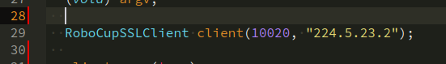
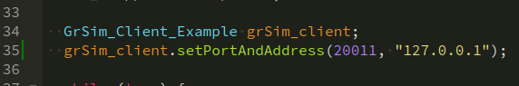

# ssl-client
> Client base code #ssl #robocup #ssl-vision #grSim 

## Description
This repository was created for the purpose of helping beginner teams.
This project is capable of:
- receive field and robot information from ssl-vision
- receive field and robot information from grSim
- Send commands to robots on grSim

Almost every material present here can be found at:

 [RoboCup/ssl-vision](https://github.com/RoboCup-SSL/ssl-vision)

 [RoboCup/grSim](https://github.com/RoboCup-SSL/grSim)

 [WarBots-RoboCup-SSL](https://github.com/findcongwang/WarBots-RoboCup-SSL)

Feel free to ask and contribute too :)

## Dependencies
- [Qt Creator](https://www.qt.io)
- [protobuf](https://github.com/google/protobuf)

*Tested with: Qt 5.15.1, protoc 3.6.1, Ubuntu 20.04 LTS*

## First Steps
1. If you have protobuf installed, check which version you use with the command:
```sh
protoc --version
```

1. If you do not, run the script on scripts folder.
1. Go to folder `/include/ssl-client/protobuf/pb/proto` and run:
```sh
sh compile.sh
```

## Usage example
1. Open the grSim.
1. Turn off all robots.
1. Put them all out of bounds.
1. Get one of the blue team robots, put it inside the field and turn on.


1. Get the Vision multicast adress, Vision multicast port and Command listen port on grSim.


1. In Qt Creator IDE open the project thru the `ssl-Clienty.pro` file.

2. Inside main, on `RoboCupSSLClient` declaration, paste the Vision Multicast adress and the Vision Multicast port inside constructor.


1. Inside main too, paste the Vision Multicast adress and the Command listen port inside `setPortAndAddress` if you want to send some info to grSim. 


1. Run the Qt Project!

#### Author: [Renato Sousa](https://github.com/renatoosousa) 

